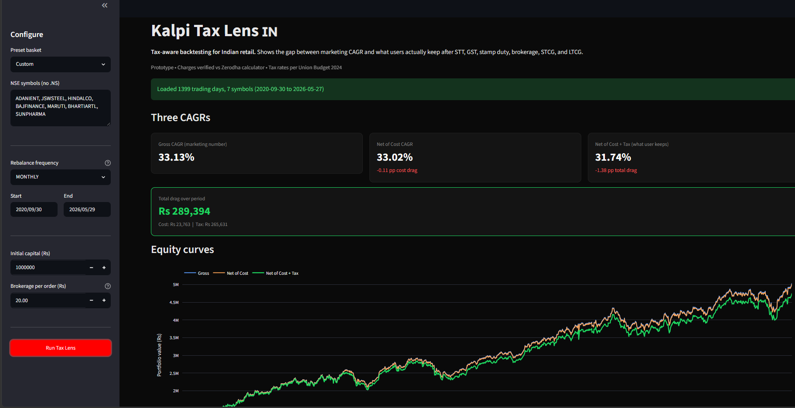

# Kalpi Tax Lens 🇮🇳
**Live demo:** [kalpi-tax-lens.streamlit.app](https://kalpi-tax-lens.streamlit.app/)


A tax-aware backtesting overlay for Indian retail equity portfolios.


Computes three CAGRs side-by-side:

1. **Gross** — what most retail backtesters report
2. **Net of cost** — after STT, stamp duty, exchange/SEBI charges, GST, brokerage
3. **Net of cost + tax** — also applies STCG (20%) and LTCG (12.5% above ₹1.25L exemption), with FIFO lot accounting and FY-end settlement

The delta between gross and net-of-everything is the difference between **what marketing shows** and **what the user keeps**.

--

## Sample results

Run on real NSE data via yfinance (Sep 2020 - May 2026):

| Strategy | Gross CAGR | After-Tax CAGR | Total Drag |
|---|---|---|---|
| IT basket, quarterly rebal | 19.71% | 19.47% | -0.24 pp |
| Mixed 8-sector, quarterly | 17.52% | 17.16% | -0.36 pp |
| High-vol 7-stock, monthly | 33.13% | 31.74% | **-1.38 pp** |

The high-vol example translates to ₹2.89 lakh of drag on a ₹10 lakh
starting portfolio over 5.5 years - of which ₹2.65 lakh is tax.

Variance from 0.24pp to 1.38pp depending on strategy is the point:
retail users currently see a single CAGR number that hides
substantial variation in real after-tax outcomes.



## Why this exists

Most Indian retail strategy platforms report gross backtest returns.
For buy-and-hold the gap is small. For active rebalancing strategies,
the gap widens — in our testing, from 0.24pp (low-turnover quarterly)
to 1.38pp+ (high-turnover monthly on volatile baskets), translating
to ₹2.89L of drag on a ₹10L portfolio.

Post-Union Budget 2024 the gap got worse:
- STCG: 15% → **20%**
- LTCG: 10% → **12.5%**
- LTCG exemption: ₹1L → ₹1.25L

Any backtester using pre-2024 tax rates is now showing wrong numbers.
Most don't apply tax at all.

## Quickstart

```bash
pip install -r requirements.txt
streamlit run app.py
```

Default loads a 6-stock IT basket (TCS, INFY, WIPRO, TECHM, LTIM, HCLTECH), equal weight, quarterly rebalance, Sep 2020 onwards.

Run tests:
```bash
python test_engine.py       # synthetic data
python test_real_data.py    # real NSE via yfinance
```

---

## Architecture

```
kalpi_tax_lens/
├── charges.py       # Indian charge stack + 2024 tax constants
├── lots.py          # FIFO lot tracker (the engine spine)
├── engine.py        # main backtest loop, generates 3 equity curves
├── metrics.py       # CAGR, Sharpe, vol, max drawdown
├── app.py           # Streamlit UI
├── test_engine.py   # synthetic-data sanity test
└── test_real_data.py # real NSE data via yfinance
```

About 600 lines total. Designed to be reviewed in 15 minutes.

---

## Verified components

**`charges.py`** reproduces Zerodha's brokerage calculator to the rupee for a ₹1 lakh delivery trade:

```
BUY ₹1,00,000:  brokerage=20  STT=100  stamp=15  exchange=2.97  sebi=0.10  gst=4.15  total=142.22
SELL ₹1,00,000: brokerage=20  STT=100  stamp=0   exchange=2.97  sebi=0.10  gst=4.15  total=127.22
```

**`lots.py`** verified with textbook FIFO: buy 100@100, buy 100@110, sell 150@130 → consumes 100 from lot 1, 50 from lot 2, both STCG, realized P&L = ₹3,978.50.

---

## What's deliberately out of scope (v0)

- **Tax-loss harvesting suggestions** — surfacing losing positions that could offset realized STCG. India has no wash-sale rule, so this is legit optimization. v2.
- **Set-off and carry-forward** — STCL offsets STCG/LTCG; LTCL only offsets LTCG; both carry forward 8 years. Currently each FY independent.
- **Lot-optimal selection** — Indian default is FIFO, but selecting specific lots can be more tax-efficient. v3.
- **Dividend tax** — slab-rate post-DDT abolition.
- **Per-broker charge profiles** — currently a single ₹/order, easy to extend.

These are noted as next iterations, not silent gaps.

---

## How this would plug into Kalpi

Kalpi's current Portfolio Studio reports CAGR, Volatility, Sharpe, Sortino, Max DD, Win Rate, Best/Worst Month — across six tabs. None currently account for transaction costs or capital gains tax.

The proposal:
1. Wrap the existing backtest output with a Tax Lens overlay
2. Add a toggle on Performance Stats: **Gross / Net of Cost / Net of Tax**
3. Add an **FY Tax Events** tab showing realized STCG, LTCG, and tax paid per FY
4. Surface cost+tax drag as a headline number

Same engine plugs into the upcoming retail Backtester (currently locked behind the institutional popup).

---

## Methodology

Charge rates per Zerodha (Nov 2024). Tax rates per Finance (No. 2) Act 2024, Section 111A and 112A as amended, effective 23-July-2024.

**FY definition:** Apr 1 → Mar 31. Tax for FY ending 31-Mar is deducted as a cash outflow on that date.

**No look-ahead bias:** rebalance trades execute at the close of the rebalance day; tax classification uses only completed buy/sell dates.

**Price data:** yfinance NSE adjusted closes. Production would use a paid feed with PIT corporate-action handling.

---

## License

MIT. Use it, fork it, ship it.

---

Built by **Meet Siroya** as a prototype contribution proposal to [Kalpi](https://kalpi.ai).

- LinkedIn: [linkedin.com/in/meet-siroya]
- Email: [meetsiroyaa@gmail.com]
